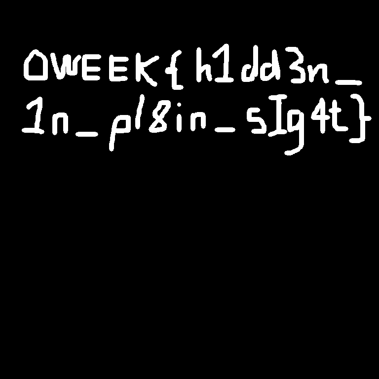

Writeup - hidden
================

This challenge involved hiding text in an image by slightly modifying the colour
of pixels. It is a form of [steganography](https://en.wikipedia.org/wiki/Steganography), albeit a simple one.

All you have to do is grab a paint-bucket tool in your favourite image editor (we recommend GIMP as we were 
too poor to afford photoshop, also paint doesn't work), set the tolerance to 0, then pour the paint over the
image. You'll get something like this.

I did a little bit of extra cleaning up by clicking in the middle of letters with holes. That's all there is to it!
